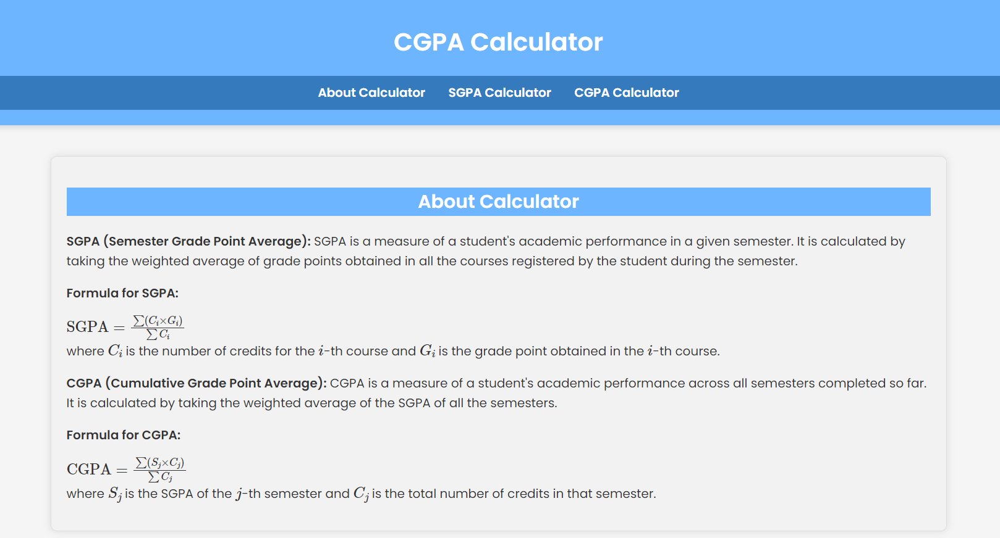
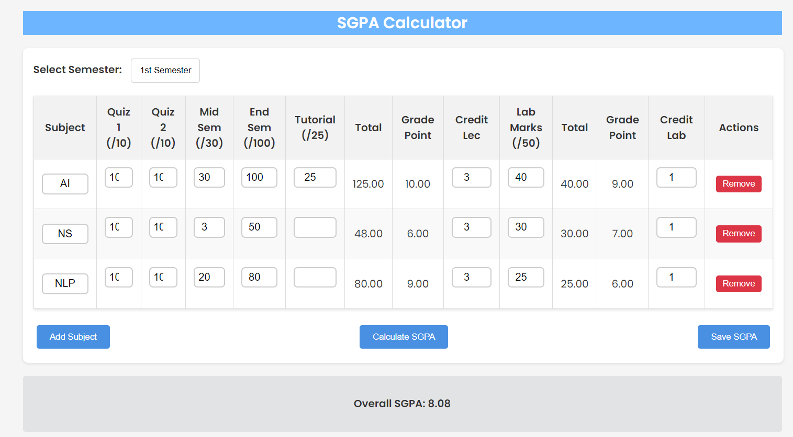

# CG Calculator

This web application calculates Semester Grade Point Average (SGPA) and Cumulative Grade Point Average (CGPA) based on the grades entered for theory and lab subjects.

## Features

- Calculate SGPA for a semester
- Calculate CGPA based on multiple semesters
- Grade point calculation based on theory and lab subjects

## Screenshots

## Usage

To use the calculator:
1. Enter marks or grades for theory subjects.
2. Enter marks or grades for lab subjects.
3. Click on the "Calculate SGPA" button to get the SGPA.
4. Add more semesters and repeat steps 1-3 to calculate CGPA.

## Grade Point Tables

### Theory Subjects

| Marks Range | Grade | Grade Point |
|-------------|-------|-------------|
| 81-100      | O     | 10          |
| 71-80       | A+    | 9           |
| 61-70       | A     | 8           |
| 53-60       | B+    | 7           |
| 47-52       | B     | 6           |
| 42-46       | C     | 5           |
| 36-41       | D     | 4           |
| 0-35        | F     | 0           |

### Lab Subjects

| Marks Range | Grade | Grade Point |
|-------------|-------|-------------|
| 41-50       | O     | 10          |
| 35-40       | A+    | 9           |
| 32-34       | A     | 8           |
| 30-31       | B+    | 7           |
| 25-29       | B     | 6           |
| 22-24       | C     | 5           |
| 18-21       | D     | 4           |
| 0-17        | F     | 0           |

## Formulae

- **SGPA (Semester Grade Point Average)**: SGPA = (∑ (C_i × G_i)) / (∑ C_i)
  - C_i: Credits for the i-th course
  - G_i: Grade point obtained in the i-th course

- **CGPA (Cumulative Grade Point Average)**: CGPA = (∑ (S_j × C_j)) / (∑ C_j)
  - S_j: SGPA of the j-th semester
  - C_j: Total number of credits in the j-th semester

## Technologies Used

- HTML
- CSS
- JavaScript

## Credits

This project was created by [Your Name].

## License

This project is licensed under the MIT License - see the [LICENSE](LICENSE) file for details.
